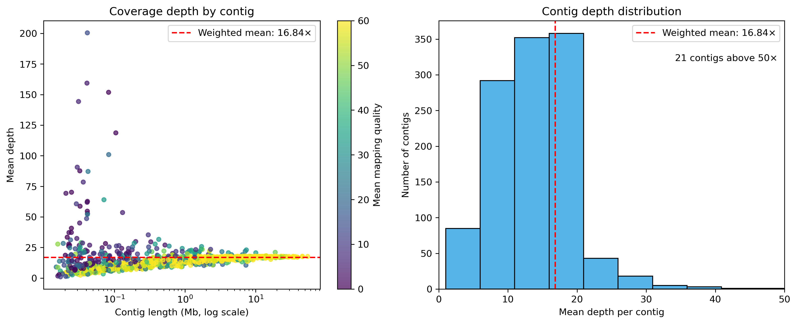

# *Pongo abelii* PacBio HiFi de novo assembly workflow

This project documents a de novo genome assembly and quality-control workflow for a *Pongo abelii* PacBio HiFi dataset. The analysis was executed on a Slurm-based Linux HPC system.

The repository is a reproducible training and portfolio project covering genome assembly, assembly statistics, conserved-gene completeness, read-supported validation, Python-based analysis, HPC job management and workflow automation.

## Project status

Completed:

- PacBio HiFi de novo assembly with hifiasm
- Conversion of hifiasm GFA outputs to FASTA
- Assembly statistics calculated with Python
- Independent validation of summary statistics using SeqKit
- BUSCO assessment using `primates_odb10`
- Comparison of primary, hap1 and hap2 outputs
- Mapping of the original HiFi reads to the primary assembly
- Alignment, breadth-of-coverage and depth summaries with SAMtools
- Python-based identification and visualization of coverage outliers
- Initial Snakemake implementation with Slurm submission

Planned:

- Comparison with a published *P. abelii* assembly
- IG/TR locus-focused evaluation
- Extension of the workflow to hap1 and hap2 mapping/QC where biologically useful
- Further workflow portability and reproducibility improvements

## Workflow overview

1. Assemble PacBio HiFi reads with hifiasm.
2. Convert assembly graph segments from GFA to FASTA.
3. Calculate contiguity and sequence statistics.
4. Assess conserved-gene completeness with BUSCO.
5. Map the original HiFi reads back to the assembly.
6. Calculate mapping, coverage and depth statistics.
7. Flag contigs with unusual breadth or depth for further inspection.
8. Connect mapping-QC steps through Snakemake and submit compute jobs through Slurm.

## Software

The workflow uses:

- hifiasm 0.25.0-r726
- minimap2 2.27-r1193
- SAMtools 1.21 / HTSlib 1.21
- SeqKit 2.9.0
- BUSCO 5.5.0
- Snakemake 7.32.4
- Python 3.13.5
- NumPy 2.2.4
- pandas 2.2.3
- Matplotlib 3.10.1
- Slurm 24.11.5

Exact versions recorded during the analysis are available in `environment/software_versions.txt`.

## Assembly

The assembly was generated from PacBio HiFi reads using:

```bash
hifiasm -o pongo_denovo -t 10 full.fastq.gz
```

Large sequencing data and assembly outputs are intentionally excluded from this repository.

### Interpretation of hifiasm outputs

The hifiasm `primary` output is a haploid-style primary representation assembled from a diploid sample. It can switch between parental haplotypes and should not be described as a fully phased diploid assembly.

The `hap1` and `hap2` outputs are partially phased haplotype-resolved representations generated from HiFi reads alone. They are not directly equivalent to the primary and alternate haplotypes distributed for every published assembly; terminology depends on the assembly method and submission structure.

## Assembly statistics

| Assembly | Contigs | Total length (bp) | Longest contig (bp) | N50 (bp) | L50 | GC (%) |
|---|---:|---:|---:|---:|---:|---:|
| Primary | 1,179 | 3,269,425,710 | 54,346,700 | 11,214,494 | 83 | 40.86 |
| Hap1 | 3,960 | 3,133,894,434 | 16,040,432 | 1,780,446 | 441 | 40.79 |
| Hap2 | 3,531 | 3,094,228,524 | 17,362,148 | 1,946,511 | 393 | 40.74 |


The primary assembly was considerably more contiguous than either haplotype output, with fewer contigs, a longer maximum contig and a higher N50.

## BUSCO gene completeness

BUSCO 5.5.0 was run in genome mode using the `primates_odb10` lineage containing 13,780 conserved gene groups.

| Assembly | Complete (%) | Single-copy (%) | Duplicated (%) | Fragmented (%) | Missing (%) |
|---|---:|---:|---:|---:|---:|
| Primary | 95.6 | 92.6 | 3.0 | 1.1 | 3.3 |
| Hap1 | 89.6 | 87.5 | 2.1 | 1.9 | 8.5 |
| Hap2 | 89.5 | 87.8 | 1.7 | 2.0 | 8.5 |


The primary assembly recovered the highest proportion of complete conserved primate genes. Hap1 and hap2 produced similar completeness results, but both contained more missing and fragmented BUSCO genes.

BUSCO evaluates conserved gene-space completeness. It does not independently prove structural correctness, phasing accuracy or resolution of complex repetitive loci.

## HiFi read mapping and coverage QC

The original PacBio HiFi reads were mapped back to the hifiasm primary assembly using minimap2 with the `map-hifi` preset. Alignments were sorted and indexed with SAMtools.

```bash
minimap2 -ax map-hifi -t 10 assembly.fa reads.fastq.gz |
    samtools sort -@ 5 -m 2G -o assembly.hifi.sorted.bam

samtools index assembly.hifi.sorted.bam
samtools flagstat assembly.hifi.sorted.bam
```

Primary-read mapping reached 99.99%. Mapping coverage was summarized across 1,179 contigs using `samtools coverage`.

| Metric | Result |
|---|---:|
| Assembly breadth | 99.997% |
| Weighted mean depth | 16.84x |
| Median contig depth | 14.44x |
| Contigs below 99% breadth | 18 |
| Flagged contigs | 253 |
| Flagged assembly length | 0.52% |



The flagged-contig set combines contigs with low breadth, unusually low depth or unusually high depth. These are candidates for further inspection, not automatically assembly errors.

Mapping the reads used for assembly back to that assembly measures read support, but it is not an independent validation of structural correctness.

## Snakemake workflow

The mapping and coverage-QC steps are represented as a dependency graph:

```text
HiFi reads + assembly
        |
        v
minimap2 mapping + SAMtools sorting
        |
        v
indexed BAM + flagstat
        |
        v
SAMtools coverage + idxstats
        |
        v
Python summary tables + QC figure
```

Copy the public configuration template and edit the copy for the local computing environment:

```bash
cp config/config.example.yaml config/config.yaml
```

The real `config/config.yaml` is ignored by Git because it may contain machine-specific paths.

Preview the workflow without running jobs:

```bash
snakemake --dry-run --printshellcmds --snakefile workflow/Snakefile
```

On a Slurm system, the included generic profile can be used after adapting the configuration:

```bash
snakemake --profile profiles/slurm --snakefile workflow/Snakefile
```

## Repository structure

```text
.
|-- README.md
|-- config/
|   `-- config.example.yaml
|-- environment/
|   `-- software_versions.txt
|-- profiles/
|   `-- slurm/config.yaml
|-- results/
|   |-- assembly_summary.tsv
|   |-- busco_summary.tsv
|   |-- figures/
|   `-- mapping/
|-- scripts/
|-- slurm/
`-- workflow/
    `-- Snakefile
```

## Data availability

Raw sequencing reads, genome assemblies, assembly graphs, alignment files and large BUSCO intermediate files are not included in this repository.

The repository contains workflow scripts, small summary tables and figures only.

## Interpretation and limitations

The current analysis measures contiguity, sequence composition, conserved-gene completeness and support from the input reads. Reference-based comparison and locus-level evaluation remain necessary before making conclusions about structural correctness or haplotype-specific variation.

Complex immunoglobulin and T-cell receptor loci will be evaluated separately because strong genome-wide N50, BUSCO and mapping values do not guarantee correct resolution of highly duplicated and structurally variable immune loci.
