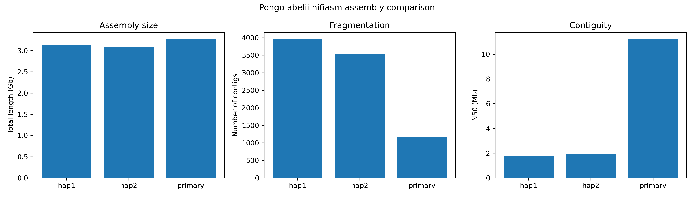
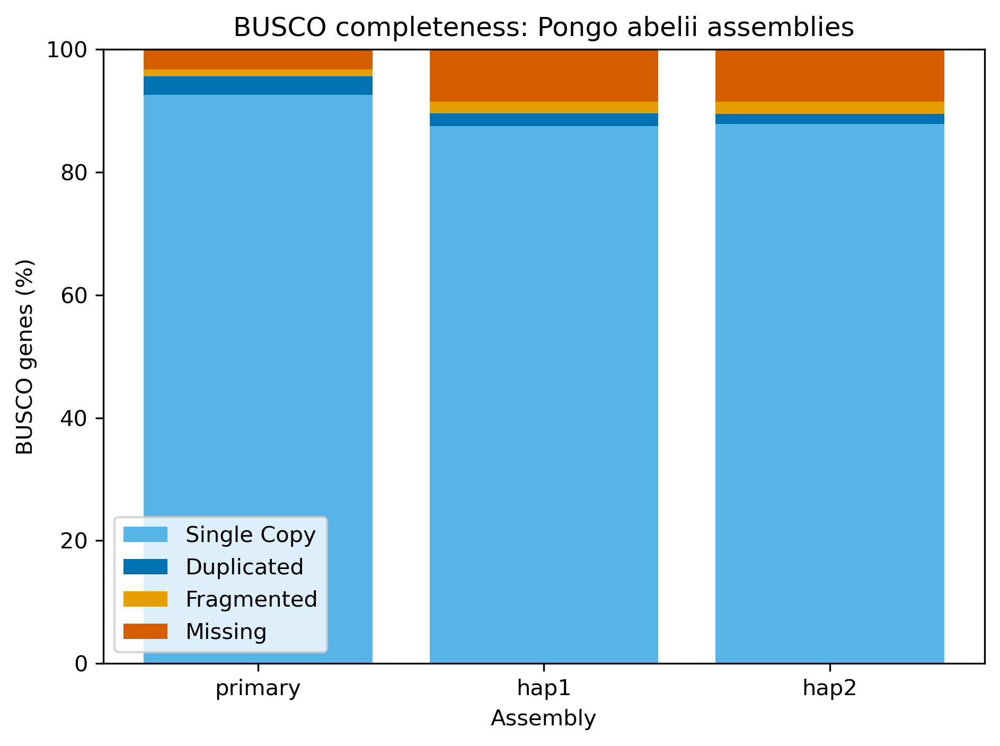

# *Pongo abelii* PacBio HiFi de novo assembly workflow

This project documents a de novo genome assembly and quality-control workflow for a *Pongo abelii* PacBio HiFi dataset. The analysis was executed on a Slurm-based Linux HPC system.

The project is a reproducible training and portfolio workflow covering genome assembly, assembly statistics, conserved-gene completeness, Python-based analysis, and HPC job management.

## Project status

Completed:

- PacBio HiFi de novo assembly with hifiasm
- Conversion of hifiasm GFA outputs to FASTA
- Assembly statistics calculated with Python
- Independent validation using SeqKit
- BUSCO assessment using `primates_odb10`
- Comparison of primary, hap1, and hap2 outputs
- Assembly and BUSCO summary figures

Planned:

- PacBio HiFi read mapping to the assemblies
- Alignment and coverage statistics
- Read-supported assembly validation
- Comparison with a published *P. abelii* assembly
- IG/TR locus-focused evaluation
- Snakemake implementation

## Assembly

The assembly was generated from PacBio HiFi reads using:

```bash
hifiasm -o pongo_denovo -t 10 full.fastq.gz
```

The analysis generated a primary assembly and two partially phased haplotype outputs.

The primary assembly is a haploid-style mosaic representation derived from a diploid individual. Hap1 and hap2 attempt to represent the two genomic copies separately, but they cannot be assigned as maternal and paternal because parental or other long-range phasing data were not provided.

## Assembly statistics

| Assembly | Contigs | Total length (bp) | Longest contig (bp) | N50 (bp) | L50 | GC (%) |
|---|---:|---:|---:|---:|---:|---:|
| Primary | 1,179 | 3,269,425,710 | 54,346,700 | 11,214,494 | 83 | 40.86 |
| Hap1 | 3,960 | 3,133,894,434 | 16,040,432 | 1,780,446 | 441 | 40.79 |
| Hap2 | 3,531 | 3,094,228,524 | 17,362,148 | 1,946,511 | 393 | 40.74 |



The primary assembly was considerably more contiguous than either haplotype output, with fewer contigs, a longer maximum contig, and a higher N50.

## BUSCO gene completeness

BUSCO 5.5.0 was run in genome mode with the `primates_odb10` lineage containing 13,780 conserved gene groups.

| Assembly | Complete (%) | Single-copy (%) | Duplicated (%) | Fragmented (%) | Missing (%) |
|---|---:|---:|---:|---:|---:|
| Primary | 95.6 | 92.6 | 3.0 | 1.1 | 3.3 |
| Hap1 | 89.6 | 87.5 | 2.1 | 1.9 | 8.5 |
| Hap2 | 89.5 | 87.8 | 1.7 | 2.0 | 8.5 |



The primary assembly recovered the highest proportion of complete conserved primate genes. Hap1 and hap2 produced nearly identical completeness results, but both contained more missing and fragmented BUSCO genes.

BUSCO evaluates conserved gene-space completeness. It does not independently prove structural correctness, phasing accuracy, or resolution of complex repetitive loci.

## Repository structure

```text
.
├── README.md
├── environment/
│   └── software_versions.txt
├── results/
│   ├── assembly_summary.tsv
│   ├── busco_summary.tsv
│   └── figures/
│       ├── assembly_summary.png
│       └── busco_comparison.png
├── scripts/
│   ├── assembly_qc.py
│   ├── plot_assembly_summary.py
│   └── plot_busco.py
└── slurm/
    ├── hifiasm_pongo.sh
    ├── seqkit_stats.sh
    ├── busco_primary.sh
    ├── busco_hap1.sh
    └── busco_hap2.sh
```

## Data availability

Raw sequencing reads, genome assemblies, assembly graphs, alignment files, and large BUSCO intermediate files are not included in this repository.

The repository contains workflow scripts, small summary tables, and figures only.

## Interpretation and limitations

The current analysis measures contiguity, sequence composition, and conserved-gene completeness. Additional read-mapping and locus-level analyses are required before making conclusions about assembly correctness or haplotype-specific structural variation.

Complex immunoglobulin and T-cell receptor loci will be evaluated separately because strong genome-wide N50 and BUSCO values do not guarantee correct resolution of highly duplicated and structurally variable immune loci.
